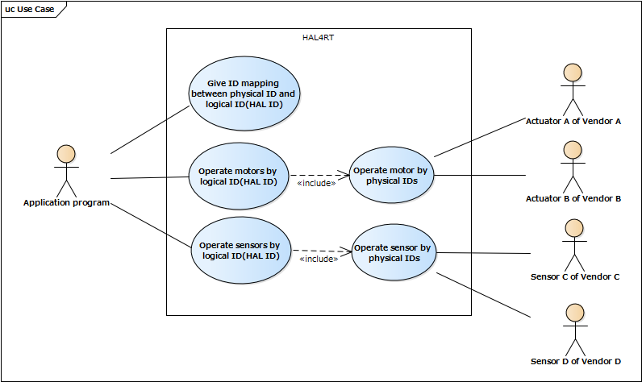
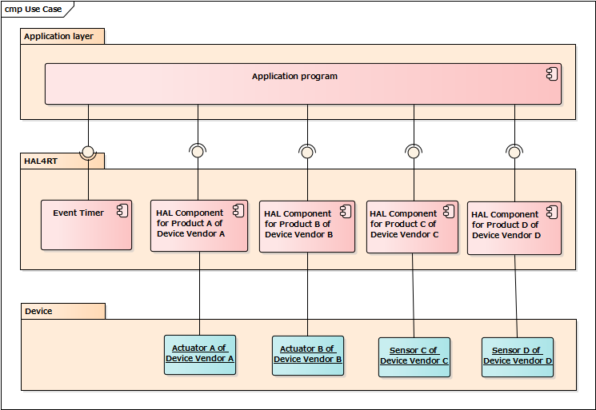
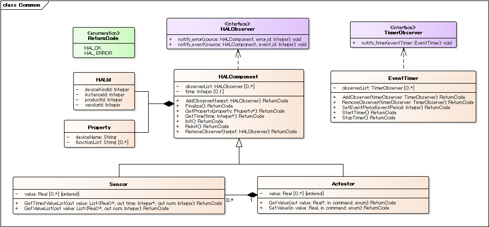
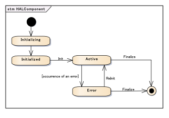
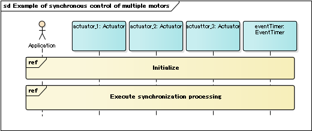
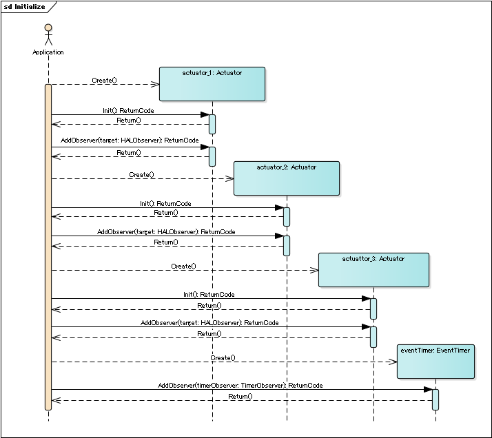
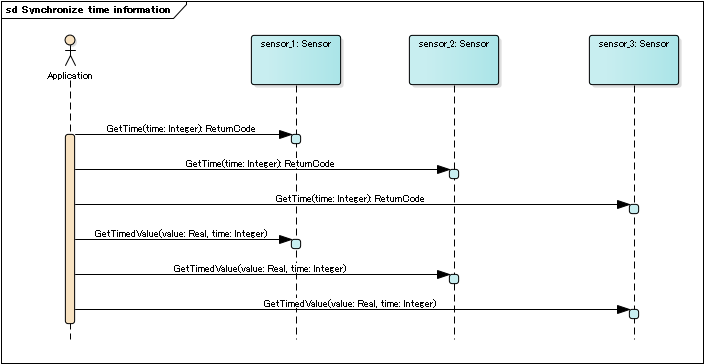

# OpenEL

OpenEL(Open Embedded Library) is a unified API(Application Programming Interface) for actuators and sensors. The specifications and implementation have been developed by [JASA(Japan Embedded Systems Technology Association)](https://www.jasa.or.jp/data/english/) since 2011.

As of October 30, 2021, version 3.2 is available.

## 1. Scope

This specification specifies OpenEL, which defines the minimum common API(Application Program Interface) required for hardware devices(actuators and sensors) used in embedded systems.

This specification defines the Platform-Independent Model (PIM) of a Hardware Abstraction Layer(HAL) for embedded systems that is capable to support at least the following devices:

- Sensors. In addition to specifying the actual, normalized measurement, sensor kind and unit of measure shall be provided.
- Actuators. Commands to perform motions, and motion feedback information shall be provided.

In addition, this specification defines the Platform Specific Model (PSM) in language C based on the HAL PIM.
This specification aims to enable engineers such as application vendors and device vendors to build software without any concern about the differences among the targeted devices, by standardizing the API of these devices.

Target readers of this specification include:

- Software engineers who use the OpenEL to develop middleware and software.
- Device vendors and its engineers who develop devices and components which conforms to the OpenEL.
- Engineers who are interested in embedded software development.

## 2. Comformance

In order to comply with this specification, the following conditions must be satisfied.

- All devices must implement the component common definition excluding Actuator and Sensor element (section 7.4.1).

- Actuator device must implement at least one concrete Actuator class (Section 7.4.1.7).

- The sensor device must implement at least one concrete Sensor class (Section 7.4.1.8).

## 3. References

### 3.1 Normative References

The following normative documents contain provisions which, through reference in this text, constitute provisions of this specification. For dated references, subsequent amendments to, or revisions of, any of these publications do not apply.

[UML] [Object Management Group, OMG Unified Modeling Language (OMG UML)](https://www.omg.org/spec/UML/2.5.1/)

[ISO/IEC-9899] International Organization for Standardization, Programming languages - C, 1999

### 3.2 Non-normative References

- [Floating-Point Typedefs Having Specified Widths – N1703](http://www.open-std.org/jtc1/sc22/wg14/www/docs/n1703.pdf)

## 4. Terms and Definition

For the purposes of this specification, the following terms and definitions apply.

None

## 5. Symbols

[HAL] Hardware Abstraction Layer

[OpenEL] Open Embedded Library

## 6. Additional Information

None

## 7. Hardware Abstraction Layer for embedded system(OpenEL)

### 7.1 General

The Hardware Abstraction Layer for embedded system(OpenEL) is a standard specification for implementing control software systems. In OpenEL, to reduce constraints on implementers such as device vendors as much as possible, only the necessary minimum common API is specified.

It is a feature of embedded system that multiple devices operate in cooperation such as synchronous control of multiple actuators and measurement using multiple sensors, therefore this specification introduces the concept of "time".

By using the standardized API specified in this specification, portability and usability of various devices and drivers can be improved.
The use case and component diagram of OpenEL is shown below.

Note: HAL4RT is the standard name when JASA proposed standardization to OMG.



Figure 7.1 Use case of OpenEL



Figure 7.2 Architecture of OpenEL

## 7.2 Format and Conventions

### 7.2.1 Class and Interface

Classes and interfaces described in this PIM are documented using tables of the following format:

Table x.x : &lt;Class / Interface Name&gt;

<table>
	<tr>
		<td colspan="6">Description : &lt;description&gt;</td>
	</tr>
	<tr>
		<td colspan="6">Derived From: &lt;parent class&gt;</td>
	</tr>
	<tr>
		<td colspan="6">Attributes</td>
	</tr>
	<tr>
		<td colspan="2">&lt;attribute name&gt;</td>
		<td>&lt;attribute type&gt;</td>
		<td>&lt;obligation&gt;</td>
		<td>&lt;occurrence&gt;</td>
		<td>&lt;description&gt;</td>
	</tr>
	<tr>
		<td colspan="2">…</td>
		<td>…</td>
		<td>…</td>
		<td>…</td>
		<td>…</td>
	</tr>
	<tr>
		<td colspan="6">Operations</td>
	</tr>
	<tr>
		<td colspan="2">&lt;operation name&gt;</td>
		<td colspan="4">&lt;description&gt;</td>
	</tr>
	<tr>
		<td>&lt;direction&gt;</td>
		<td colspan="2">&lt;parameter name&gt;</td>
		<td colspan="2">&lt;parameter type&gt;</td>
		<td>&lt;description&gt;</td>
	</tr>
	<tr>
		<td>…</td>
		<td colspan="2">…</td>
		<td colspan="2">…</td>
		<td>…</td>
	</tr>
</table>

Note that derived attributes or operations are not described explicitly.

The ‘obligation’ and ‘occurrence’ are defined as follows.

#### Obligation

    M (mandatory): This attribute shall always be supplied.
    O (optional): This attribute may be supplied.
    C (conditional): This attribute shall be supplied under a condition. The condition is given as a part of the attribute description.

#### Occurrence

The occurrence column indicates the maximum number of occurrences of the attribute values that are permissible. The followings denote special meanings.

    N: No upper limit in the number of occurrences.
    ord: The appearance of the attribute values shall be ordered.
    unq: The appeared attribute values shall be unique.

### 7.2.2 Enumeration

Enumerations are documented as follows:

Table x.x: < enumeration name >

<table align="center">
    <tr>
        <td align="left">< constant name ></td>
        <td align="left">< description></td>
    </tr>
    <tr>
        <td align="left">...</td>
        <td align="left">...</td>
    </tr>
</table>

## 7.3 Return Codes

At the PIM level we have modeled errors as operation return codes typed __ReturnCode__. Each PSM may map these to either return codes or exceptions. The complete list of return codes is indicated below.

Table 7.1: ReturnCode enumeration

<table>
    <tr>
        <td align="left">HAL_OK</td>
        <td align="left">The operation completed successfully.</td>
    </tr>
    <tr>
        <td align="left">HAL_ERROR</td>
        <td align="left">An error occurred during execution of processing.</td>
    </tr>
</table>

## 7.4 Platform Independent Model (PIM)

### 7.4.1 Common definition

The common part defines a mechanism for managing devices. All the components need to implement the contents defined in the common part excluding Actuator and Sensor element. The class diagram of the common part is shown below.



Figure 7.3 Common part

### 7.4.1.1 HALComponent

HALComponent is an element that holds information that all components should have in common.

It is possible to define a HALComponent with both Sensor and Actuator characteristics, such as cameras with gimbal mechanisms.

<table>
	<tr>
		<td colspan="12">Derived From: None</td>
	</tr>
	<tr>
		<td colspan="12">Attributes</td>
	</tr>
	<tr>
		<td colspan="4">halId</td>
		<td colspan="3">HALId</td>
		<td>M</td>
		<td colspan="2">1</td>
		<td colspan="2">ID for identifying the component.</td>
	</tr>
	<tr>
		<td colspan="4">property</td>
		<td colspan="3">Property</td>
		<td>M</td>
		<td colspan="2">1</td>
		<td colspan="2">Details of the implementation content of each component.</td>
	</tr>
	<tr>
		<td colspan="4">observerList</td>
		<td colspan="3">HALObserver</td>
		<td>O</td>
		<td colspan="2">N</td>
		<td colspan="2">A list of observers to notify upper-level applications of component-side information.</td>
	</tr>
	<tr>
		<td colspan="4" rowspan="4">time</td>
		<td colspan="3" rowspan="4">Integer</td>
		<td rowspan="4">O</td>
		<td colspan="2" rowspan="4">1</td>
		<td colspan="2">Component time information.</td>
	</tr>
	<tr>
		<td colspan="2">Time information of timer (OS timer, timer possessed by device, etc.) referenced by HALComponent.</td>
	</tr>
	<tr>
		<td colspan="2">It is used to acquire data with time from a sensor without time information.</td>
	</tr>
	<tr>
		<td colspan="2">The unit of time is implementation dependent.</td>
	</tr>
	<tr>
		<td colspan="12">Operations</td>
	</tr>
	<tr>
		<td colspan="6">Init</td>
		<td colspan="6">Perform initialization processing of HALComponent.</td>
	</tr>
	<tr>
		<td colspan="6">ReInit</td>
		<td colspan="6">Reset HALComponent. Reset error condition and return to normal state.</td>
	</tr>
	<tr>
		<td colspan="6">Finalize</td>
		<td colspan="6">Quit HAL Component.</td>
	</tr>
	<tr>
		<td colspan="6">AddObserver</td>
		<td colspan="6">Register an observer for notifying the event from the HALComponent to the upper application.</td>
	</tr>
	<tr>
		<td colspan="2">in</td>
		<td colspan="2">target</td>
		<td colspan="4">HALObserver</td>
		<td colspan="2">M</td>
		<td colspan="2">Observer to be registered.</td>
	</tr>
	<tr>
		<td colspan="6">RemoveObserver</td>
		<td colspan="6">Unregister observer set in HALComponent.</td>
	</tr>
	<tr>
		<td colspan="2">in</td>
		<td colspan="2">target</td>
		<td colspan="4">HALObserver</td>
		<td colspan="2">M</td>
		<td colspan="2">Observer to be unregistered.</td>
	</tr>
	<tr>
		<td colspan="6">GetProfile</td>
		<td colspan="6">Acquire property information of HALComponent</td>
	</tr>
	<tr>
		<td colspan="2">out</td>
		<td colspan="2">profile</td>
		<td colspan="4">Profile</td>
		<td colspan="2">M</td>
		<td colspan="2">Profile information of HALComponent.</td>
	</tr>
	<tr>
		<td colspan="6">GetTime</td>
		<td colspan="6">Get the time information of HALComponent. For components that do not have the time attribute, HAL_Error is returned.</td>
	</tr>
	<tr>
		<td colspan="2">out</td>
		<td colspan="2">time</td>
		<td colspan="4">Integer</td>
		<td colspan="2">M</td>
		<td colspan="2">Time information of HALComponent</td>
	</tr>
</table>

### State transition

The State Machine of the HAL Component is shown below. Note that state transitions specific to each device are defined within the "Active" state.



Figure 7.4 State Machine of HALComponent

Details of each state are shown below.

- Initializing: A state in which device-specific processing is performed. Methods of HALComponent cannot be called.

- Initialized: The state where initialization of the device is completed. Only Init() is callable.

- Active: A state in which it is operating as a HALComponent. All APIs of HALComponent other than Init() and ReInit() can be called.

- Error: A state in which the operation is stopped due to an internal error etc. ReInit() and Finalize() can be called.

### 7.4.1.2 HALId

HALId is an element representing the Id identifying a HALComponent.

<table>
	<tr>
		<td colspan="6">Derived From: None</td>
	</tr>
	<tr>
		<td colspan="6">Attributes</td>
	</tr>
	<tr>
		<td colspan="2" rowspan="2">deviceKindId</td>
		<td rowspan="2">Integer</td>
		<td rowspan="2">M</td>
		<td rowspan="2">1</td>
		<td>Identifier for identifying the type of device.</td>
	</tr>
	<tr>
		<td>OMG performs management.</td>
	</tr>
	<tr>
		<td colspan="2" rowspan="2">vendorId</td>
		<td rowspan="2">Integer</td>
		<td rowspan="2">M</td>
		<td rowspan="2">1</td>
		<td>Identifier for identifying the device vendor.</td>
	</tr>
	<tr>
		<td>OMG performs management.</td>
	</tr>
	<tr>
		<td colspan="2" rowspan="2">productId</td>
		<td rowspan="2">Integer</td>
		<td rowspan="2">M</td>
		<td rowspan="2">1</td>
		<td>Identifier for identifying the product.</td>
	</tr>
	<tr>
		<td>The device vendor gives a unique numbering.</td>
	</tr>
	<tr>
		<td colspan="2" rowspan="2">instanceId</td>
		<td rowspan="2">Integer</td>
		<td rowspan="2">M</td>
		<td rowspan="2">1</td>
		<td>An identifier for identifying each device. When multiple products of the same type are used in the target system, they are used to identify them.</td>
	</tr>
	<tr>
		<td>The application creator sets in advance by some means.</td>
	</tr>
</table>

### 7.4.1.3 Property

Property is an element for holding details of the function of HALComponent.

<table>
	<tr>
		<td colspan="6">Derived From: None</td>
	</tr>
	<tr>
		<td colspan="6">Attributes</td>
	</tr>
	<tr>
		<td colspan="2">id</td>
		<td>HALId</td>
		<td>M</td>
		<td>1</td>
		<td>An identifier representing the corresponding HALComponent.</td>
	</tr>
	<tr>
		<td colspan="2">deviceName</td>
		<td>String</td>
		<td>M</td>
		<td>1</td>
		<td>Name of HALComponent.</td>
	</tr>
	<tr>
		<td colspan="2" rowspan="2">functionList</td>
		<td rowspan="2">String</td>
		<td rowspan="2">M</td>
		<td rowspan="2">1</td>
		<td>List of function names implemented by HALComponent.</td>
	</tr>
	<tr>
		<td>When a device vendor adds and extends its own method, it describes which method is implemented by the target HALComponent. The whole image of the expanded original method is prepared by the device vendor with a spec sheet etc. The application creator shall know in advance what kind of extension method is defined.</td>
	</tr>
</table>

### 7.4.1.4 EventTimer

The EventTimer is an element used when synchronous control is performed for a plurality of HALComponents.

There are many kind of event timers (POSIX, proprietary RTOS, ... etc). The EventTimer unifies the APIs of different timers.

The EventTimer class is independent of HALComponent.

<table>
	<tr>
		<td colspan="12">Derived From: None</td>
	</tr>
	<tr>
		<td colspan="12">Attributes</td>
	</tr>
	<tr>
		<td colspan="4">observerList</td>
		<td colspan="3">TimerObserver</td>
		<td>O</td>
		<td colspan="2">N</td>
		<td colspan="2">A list of observers to notify upper applications that the timer has timed out</td>
	</tr>
	<tr>
		<td colspan="12">Operations</td>
	</tr>
	<tr>
		<td colspan="6">StartTimer</td>
		<td colspan="6">Start the event timer.</td>
	</tr>
	<tr>
		<td colspan="6">StopTimer</td>
		<td colspan="6">Stop the event timer.</td>
	</tr>
	<tr>
		<td colspan="6">SetEventPeriod</td>
		<td colspan="6">Set the event occurrence cycle.</td>
	</tr>
	<tr>
		<td colspan="2">in</td>
		<td colspan="2">EventPeriod</td>
		<td colspan="4">Integer</td>
		<td colspan="2">M</td>
		<td colspan="2">Event occurrence cycle</td>
	</tr>
	<tr>
		<td colspan="6">AddObserver</td>
		<td colspan="6">Register an observer for notifying the timeout event from the EventTimer to the upper application.</td>
	</tr>
	<tr>
		<td colspan="2">in</td>
		<td colspan="2">target</td>
		<td colspan="4">TimerObserver</td>
		<td colspan="2">M</td>
		<td colspan="2">Observer to be registered</td>
	</tr>
	<tr>
		<td colspan="6">RemoveObserver</td>
		<td colspan="6">Unregister the observer set in EventTimer.</td>
	</tr>
	<tr>
		<td colspan="2">in</td>
		<td colspan="2">target</td>
		<td colspan="4">TimerObserver</td>
		<td colspan="2">M</td>
		<td colspan="2">Observer to be unregistered</td>
	</tr>
</table>

### 7.4.1.5 HALObserver

ALObserver is an interface for communicating the event occurrences in HALComponent to the application. For applications that use HALComponent, it is necessary to implement elements that realize this interface.

<table>
	<tr>
		<td colspan="7">Operations</td>
	</tr>
	<tr>
		<td colspan="4">notify_event</td>
		<td colspan="3">Notify of an event occurred in HALComponent.</td>
	</tr>
	<tr>
		<td>in</td>
		<td>source</td>
		<td colspan="2">HALComponent</td>
		<td>M</td>
		<td colspan="2">HALComponent object that occurred the event.</td>
	</tr>
	<tr>
		<td rowspan="2">in</td>
		<td rowspan="2">event_id</td>
		<td colspan="2" rowspan="2">Integer</td>
		<td rowspan="2">M</td>
		<td colspan="2">An identifier for distinguishing the type of event that has occurred.</td>
	</tr>
	<tr>
		<td colspan="2">It is not an identifier for distinguishing individual events that have occurred.</td>
	</tr>
	<tr>
		<td colspan="4">notify_error</td>
		<td colspan="3">Notify of errors occurred in HALComponent.</td>
	</tr>
	<tr>
		<td>in</td>
		<td>source</td>
		<td colspan="2">HALComponent</td>
		<td>M</td>
		<td colspan="2">HALComponent object that occurred the error.</td>
	</tr>
	<tr>
		<td rowspan="2">in</td>
		<td rowspan="2">error_id</td>
		<td colspan="2" rowspan="2">Integer</td>
		<td rowspan="2">M</td>
		<td colspan="2">An identifier to distinguish the type of error that occurred.</td>
	</tr>
	<tr>
		<td colspan="2">It is not an identifier for distinguishing individual errors that have occurred.</td>
	</tr>
</table>

### 7.4.1.6 TimerObserver

TimerObserver is an interface for communicating the timeout event generated by the EventTimer to the application. Applications that use timer information, such as synchronous control of multiple actuators using EventTimer, need to implement elements that realize this interface.

<table>
	<tr>
		<td colspan="7">Operations</td>
	</tr>
	<tr>
		<td colspan="4">notify_timer</td>
		<td colspan="3">Notify of timeout event generated by EventTimer.</td>
	</tr>
	<tr>
		<td>in</td>
		<td>eventTimer</td>
		<td colspan="2">EventTimer</td>
		<td>M</td>
		<td colspan="2">EventTimer object that timed out.</td>
	</tr>
</table>

### 7.4.1.7 Actuator

The Actuator element defines the API that an Actuator device with one degree of freedom
should provide.

<table>
	<tr>
		<td colspan="12">Derived From: HALComponent</td>
	</tr>
	<tr>
		<td colspan="12">Attributes</td>
	</tr>
	<tr>
		<td colspan="4" rowspan="2">value</td>
		<td colspan="3" rowspan="2">Real</td>
		<td colspan="2" rowspan="2">M</td>
		<td colspan="2" rowspan="2">NOrd</td>
		<td>Actual value of the target actuator. If the actual angle / position / velocity / torque cannot be measured, estimated value or command value.</td>
	</tr>
	<tr>
		<td>Unit: [rad] or [m] / [rad/s] or [m/s] / [Nm] or [N]</td>
	</tr>
	<tr>
		<td colspan="12">Operations</td>
	</tr>
	<tr>
		<td colspan="5">GetValue</td>
		<td colspan="7">Obtain the actual angle / position / velocity / torque of the target actuator. If the actual angle / position / velocity / torque cannot be measured, return the estimated value or command value.</td>
	</tr>
	<tr>
		<td colspan="2" rowspan="2">out</td>
		<td colspan="3" rowspan="2">value</td>
		<td colspan="2" rowspan="2">Real</td>
		<td colspan="2" rowspan="2">1</td>
		<td colspan="3">Actual actuator angle / position / velocity / torque.</td>
	</tr>
	<tr>
		<td colspan="3">Unit: [rad] or [m] / [rad/s] or [m/s] / [Nm] or [N]</td>
	</tr>
	<tr>
		<td colspan="2" rowspan="2">in</td>
		<td colspan="3" rowspan="2">command</td>
		<td colspan="2" rowspan="2">Enum</td>
		<td colspan="2" rowspan="2">1</td>
		<td colspan="3">Actuator Controller mode.</td>
	</tr>
	<tr>
		<td colspan="3">Command : POSITION / VELOCITY / TORQUE</td>
	</tr>
	<tr>
		<td colspan="5" rowspan="4">SetValue</td>
		<td colspan="7">Move the actuator to the target angle / position / velocity / torque.</td>
	</tr>
	<tr>
		<td colspan="7">This method is asynchronous and does not wait until the actuator reaches the target angle / position / velocity / torque.</td>
	</tr>
	<tr>
		<td colspan="7">If this method is called again before the actuator reaches the target angle / position / velocity / torque, the target angle / position / velocity / torque is updated.</td>
	</tr>
	<tr>
		<td colspan="7">The fact that the actuator has reached the target angle / position / velocity / torque is notified to the application side using HALObserver. However, this notification is issued only when it reaches the final target angle / position / velocity / torque. Therefore, when this method is called a plurality of times and the target angle / position / velocity / torque is updated, only the notification corresponding to the method setting the final target angle / position / velocity / torque is performed.</td>
	</tr>
	<tr>
		<td colspan="2" rowspan="2">in</td>
		<td colspan="3" rowspan="2">value</td>
		<td colspan="2" rowspan="2">Real</td>
		<td colspan="2" rowspan="2">1</td>
		<td colspan="3">Target angle / position / velocity / torque command.</td>
	</tr>
	<tr>
		<td colspan="3">Unit: [rad] or [m] / [rad/s] or [m/s] / [Nm] or [N]</td>
	</tr>
	<tr>
		<td colspan="2" rowspan="2">in</td>
		<td colspan="3" rowspan="2">command</td>
		<td colspan="2" rowspan="2">Integer</td>
		<td colspan="2" rowspan="2">1</td>
		<td colspan="3">Actuator Controller mode.</td>
	</tr>
	<tr>
		<td colspan="3">Command : POSITION_CONTROL=1 / VELOCITY_CONTROL=2 / TORQUE_CONTROL=3</td>
	</tr>
</table>

The sample sequence diagram for synchronous control of multiple actuators using the API
defined above is shown below.



Figure 7.5 The sample sequence diagram for synchronous control of multiple actuators.



Figure 7.6 Execute the initialization process.


Figure 7.7 Execute synchronous control.

### 7.4.1.8 Sensor

The Sensor element defines the API that a Sensor device should provide.

Like actuator devices, observers can be added and removed for sensor devices as well.

<table>
	<tr>
		<td colspan="12">Derived From: HALComponent</td>
	</tr>
	<tr>
		<td colspan="12">Attributes</td>
	</tr>
	<tr>
		<td colspan="4">value</td>
		<td colspan="3">Real</td>
		<td>M</td>
		<td colspan="2">NOrd</td>
		<td colspan="2">Measurement value of sensor device</td>
	</tr>
	<tr>
		<td colspan="12">Operations</td>
	</tr>
	<tr>
		<td colspan="6" rowspan="3">GetValue</td>
		<td colspan="6">Acquire sensor measurement value.</td>
	</tr>
	<tr>
		<td colspan="6">Used to acquire the sensor measurement value from the application side.</td>
	</tr>
	<tr>
		<td colspan="6">The sensor measurement value is output in the International System of Units.</td>
	</tr>
	<tr>
		<td colspan="2">out</td>
		<td colspan="2">value</td>
		<td colspan="4">Real</td>
		<td colspan="2">NOrd</td>
		<td colspan="2">Sensor measurement value.</td>
	</tr>
	<tr>
		<td colspan="2">out</td>
		<td colspan="2">num</td>
		<td colspan="4">Integer</td>
		<td colspan="2">M</td>
		<td colspan="2">Number of value.</td>
	</tr>
	<tr>
		<td colspan="6" rowspan="3">GetTimedValue</td>
		<td colspan="6">Acquire sensor measurement value and measurement time.</td>
	</tr>
	<tr>
		<td colspan="6">Used to acquire the sensor measurement value from the application side. Time returns the time value defined by HALComponent.</td>
	</tr>
	<tr>
		<td colspan="6">The sensor measurement value is in the International System of Units.</td>
	</tr>
	<tr>
		<td colspan="2">out</td>
		<td colspan="2">value</td>
		<td colspan="4">Real</td>
		<td colspan="2">NOrd</td>
		<td colspan="2">Sensor measurement value.</td>
	</tr>
	<tr>
		<td colspan="2">out</td>
		<td colspan="2">num</td>
		<td colspan="4">Integer</td>
		<td colspan="2">M</td>
		<td colspan="2">Number of value.</td>
	</tr>
	<tr>
		<td colspan="2">out</td>
		<td colspan="2">time</td>
		<td colspan="4">Integer</td>
		<td colspan="2">M</td>
		<td colspan="2">Time value defined by HALComponent</td>
	</tr>
</table>

The sample sequence diagram for synchronizing time information among multiple sensors using the API defined above is shown below.



Figure 7.8 Execute synchronous control of multiple sensors.

## 7.5 Platform Specific Model(PSM)

This section specifies the PSM for OpenEL. OpenEL offers only one PSM, which is based on the ISO/IEC 9899:1999 Programming Language C (also known as C99).

### 7.5.1 PIM-PSM mapping rule

The mapping rules between PIM and PSM are shown below.
- PIM classes are mapped to C structures.
- PIM interfaces are mapped to C functions.
- PIM enumerated types are mapped to C enums or macro.
- Since it is difficult to realize generalization in C, implement the contents defined in all superclasses in the lowest
subclass.
-  The out-type argument of each method is mapped to a pointer.

### 7.5.2 Type Definition

Primitive types used in PIM are mapped to the following types respectively.
-  Integer: int32_t
- String: pointer
- Real: halfloat(float32_t or float64_t)
Also, for elements with multiplicity of *, map to pointer.

### 7.5.3 C PSM

**Note**:

The correct (system-specific) header file defining sized types (here: int32_t) must be included.

In macOS and probably other BSD-based systems that would be:

`#include </usr/include/sys/types.h>`

In many Linux systems this would be:

`#include </usr/include/stdint.h>`

But the actual path and header name may vary from system to system

```
/* ==================================================
* IMPORTANT - You need to inlude the system-specific header file
* that defines type "int32_t" here.
* ================================================== */

#ifndef HAL4RT_H
#define HAL4RT_H

#ifdef __cplusplus
namespace hal {
extern "C" {
#endif /* __cplusplus */

enum ReturnCode {
  HAL_OK = 0,
  HAL_ERROR
};

/* typedef definition */
typedef float  float32_t;
typedef double float64_t;
#if HAL_SW_FLOAT_SIZE
  typedef float32_t HALFLOAT_T;
#else
  typedef float64_t HALFLOAT_T;
#endif

typedef struct HalLinkedList_st {
        struct HalLinkedList_st *pNext;
} HAL_LINKED_LIST_T;

#define HAL_LINKED_LIST_HEAD HAL_LINKED_LIST_T linkedList;

typedef struct HalID_st {
  int32_t deviceKindId;
	int32_t vendorId;
	int32_t productId;
	int32_t instanceId;
} HALID_T;

typedef struct HalProperty_st {
	char *deviceName;
	char **sizeFunctionList;
} HALPROPERTY_T;

typedef struct HalComponent_st HALCOMPONENT_T;

typedef struct HALObserver {
	HAL_LINKED_LIST_HEAD
  void (*notify_event)(HALCOMPONENT_T *halComponent, int32_t eventId);
	void (*notify_error)(HALCOMPONENT_T *halComponent, int32_t errorId);
} HALOBSERVER_T;

#define HALCOMPONENT_BASE_MEMBER \
	int32_t handle; \
	HALID_T halId;\
	HALPROPERTY_T *property;\
	HALOBSERVER_T *observerList;\
	int32_t time;

typedef struct HalComponent_st {
	HALCOMPONENT_BASE_MEMBER
} HALCOMPONENT_T;

enum ReturnCode HalInit(HALCOMPONENT_T *halComponent);
enum ReturnCode HalReInit(HALCOMPONENT_T *halComponent);
enum ReturnCode HalFinalize(HALCOMPONENT_T *halComponent);
enum ReturnCode HalAddObserver(HALCOMPONENT_T *halComponent, HALOBSERVER_T *halObserver);
enum ReturnCode HalRemoveObserver(HALCOMPONENT_T *halComponent, HALOBSERVER_T *halObserver);
enum ReturnCode HalGetProperty(HALCOMPONENT_T *halComponent, HALPROPERTY_T *property);
enum ReturnCode HalGetTime(HALCOMPONENT_T *halComponent, int32_t *time_value);

typedef struct HalEventTimer_st HALEVENTTIMER_T;

typedef struct HalTimerObserver_st {
  HAL_LINKED_LIST_HEAD
  void (*notify_timer)(EVENTTIMER_T *eventTimer);
} HALTIMEROBSERVER_T;

typedef struct HalEventTimer_st {
  TIMEROBSERVER_T *observerList;
  int32_t eventPeriod;
} HALEVENTTIMER_T;

enum ReturnCode HalEventTimerStartTimer(EVENTTIMER_T *eventTimer);
enum ReturnCode HalEventTimerStopTimer(EVENTTIMER_T *eventTimer);
enum ReturnCode HalEventTimerSetEventPeriod(EVENTTIMER_T *eventTimer, int32_t eventPeriod);
enum ReturnCode HalEventTimerAddObserver(EVENTTIMER_T *eventTimer, TIMEROBSERVER_T *timerObserver);
enum ReturnCode HalEventTimerRemoveObserver(EVENTTIMER_T *eventTimer, TIMEROBSERVER_T *timerObserver);

typedef struct Actuator_st {
  /* HALCOMPONENT */
  HALCOMPONENT_BASE_MEMBER
  /* ACTUATOR */
  HALFLOAT_T *valueList;
} ACTUATOR_T;

#define HAL_REQUEST_POSITION_CONTROL   (1)
#define HAL_REQUEST_VELOCITY_CONTROL    (2)
#define HAL_REQUEST_TORQUE_CONTROL      (3)

enum ReturnCode HalMotorSetCommandValue(HALCOMPONENT_T *halComponent, int32_t request, HALFLOAT_T value);
enum ReturnCode HalMotorGetActualValue(HALCOMPONENT_T *halComponent, int32_t request, HALFLOAT_T *value);

typedef struct Sensor_st {
  /* HALCOMPONENT */
  HALCOMPONENT_BASE_MEMBER
  /* SENSOR */
  HALFLOAT_T *valueList;
} SENSOR_T;

enum ReturnCode HalSensorGetValueList(HALCOMPONENT_T *halComponent, int32_t *num, HALFLOAT_T *list);
enum ReturnCode HalSensorGetTimedValueList(HALCOMPONENT_T *halComponent, int32_t *num, HALFLOAT_T *list, int32_t *time);

#ifdef __cplusplus
} /* extern "C" */
} /* namespace hal */
#endif /* __cplusplus */

#endif /* HAL4RT_H */
```

